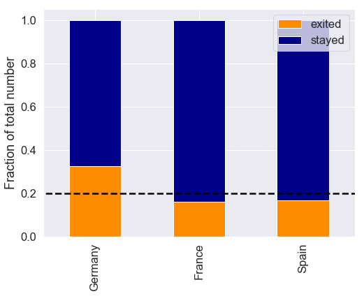
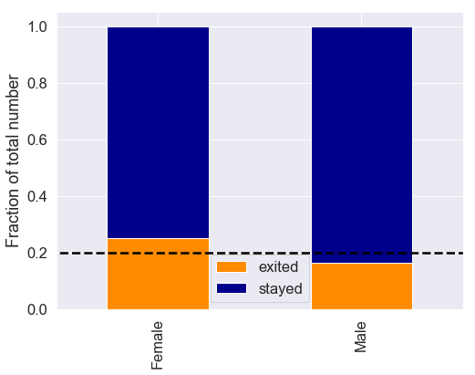
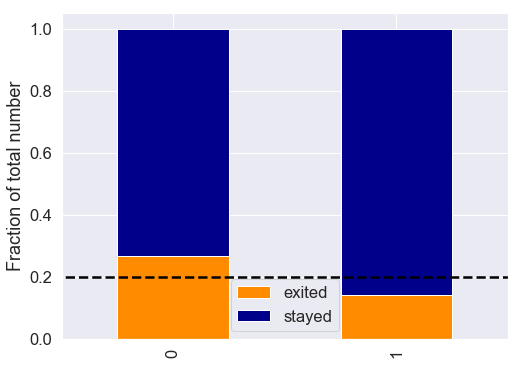
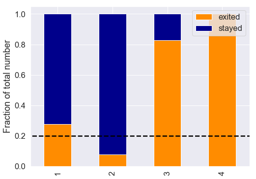
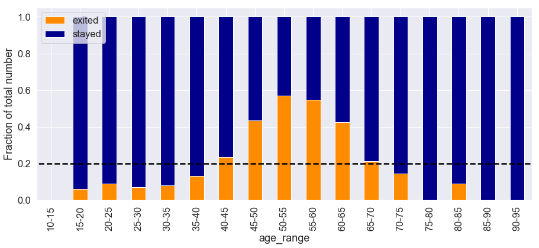
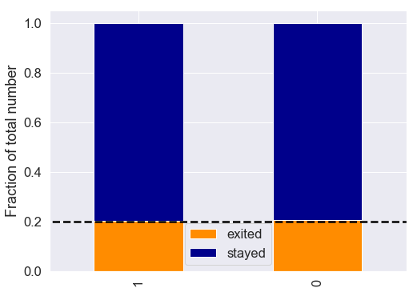
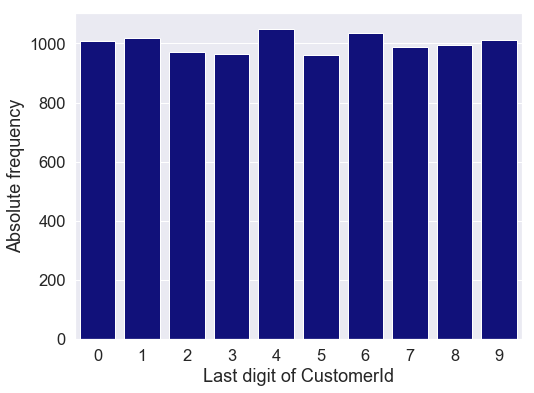
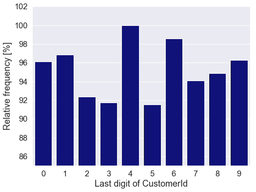

# Bank customer churn prediction: ETL


In this project, the overall goal is to predict the churn of bank customers. From a business perspective, this is very relevant for the effort to retain customers with the ultimate end goal of increasing profitability.

Customer churn is defined as the percentage of customers that stopped using a company's product or service offering in a defined time frame. One might consider that customer churn is not so important as long as more new customers are acquired than lost to the company. This is fogetting entirely the cost of acquiring new customers. Bringing in new customers is a lot less profitable than retaining customers. In financial services, for example, a 5% increase in customer retention produces more than a 25% increase in profit (http://www2.bain.com/Images/BB_Prescription_cutting_costs.pdf). The reason for that is because returning customers spend on average more than already existing customers. In online services, a loyal customer spends on average 2/3 more than a new one (http://www2.bain.com/Images/Value_online_customer_loyalty_you_capture.pdf). At the same time there is a cost associated with acquiring new customers, which decreases when less new customers have to be acquired. Keeping existing customers thus allows for a reallocation of funds away from the need of growing by acquiring new customers. 

Customer churn can be reduced by pooling resources into keeping the most profitable customers, instead of focusing on keeping overall customer numbers (even unprofitable ones). Another option would be to find out why and when customers are leaving, thus targeting in a customer lifetime this specific point and put effort into avoiding churn. In either case, the customer churn has to be thoroughly analyzed, which is what this small example project is designed to deliver.

## Outline

This churn prediction project follows this outline:

1. Dataset description
2. Descriptive visualizations using Tableau
3. **Data extraction, transforming, and loading (ETL)**
4. Analysis of the dataset
5. Visualization of the insights

In this part of the project, stage 3 is covered. Stages 1 and 2 can be found <a href='http://heikokromer.com/index.php/2020/01/10/bank-customer-churn-prediction-identifying-the-question/' target="_blank">here</a>.


```python
import pandas as pd
import numpy as np
from scipy import stats
import matplotlib.pyplot as plt
import seaborn as sns
```


```python
class ETL():
    """ Class for the ETL part that contains all the methods"""
    def __init__(self):
        self.save_path_prepared = '../02.Prepared_data/'
        
    def load_data(self, path):
        """
        Reads and returns the dataset.
        """
        data = pd.read_excel(path)
        
        return data
    
    def get_dummies(self, df, colname):
        """
        Does one hot encoding on the dataframe df on column colname. Returns the dataframe.
        """
        df_dummy = pd.get_dummies(df[colname], prefix=colname)  # dummy encoding
        df = pd.concat([df, df_dummy], axis=1)  # combine the dfs
        df = df.drop(colname, axis=1) # remove the original column

        return df
    
    def save_data_prepared(self, dataframe, filename):
        """
        Saves the dataframe with the filename intot he prepared folder.
        """
        dataframe.to_csv(f"{self.save_path_prepared}/{filename}")

        return None
```

## 1. Loading the dataset


```python
# Constants
FNAME = '../01.Original_data/P12-Churn-Modelling.xlsx' # path to the original dataset
data = ETL().load_data(FNAME)
```

## 2. Exploration of the columns

In this step, the objective is to find if there are any missing values, if the datatypes are correct, and identify outliers.


```python
data.info()
```

    <class 'pandas.core.frame.DataFrame'>
    RangeIndex: 10000 entries, 0 to 9999
    Data columns (total 14 columns):
    RowNumber          10000 non-null int64
    CustomerId         10000 non-null int64
    Surname            10000 non-null object
    CreditScore        10000 non-null int64
    Geography          10000 non-null object
    Gender             10000 non-null object
    Age                10000 non-null int64
    Tenure             10000 non-null int64
    Balance            10000 non-null float64
    NumOfProducts      10000 non-null int64
    HasCrCard          10000 non-null int64
    IsActiveMember     10000 non-null int64
    EstimatedSalary    10000 non-null float64
    Exited             10000 non-null int64
    dtypes: float64(2), int64(9), object(3)
    memory usage: 1.1+ MB


There are 14 columns which were already investigated in the previous step of the project. There was no complete description given with this dataset, during the Udemy-course "Data Science A-to-Z" from Kirill Eremenko some of the columns where verbally introduced (indicated with the label `verified`), but not all of them. Hence so the following column description is a "best guess" estimation for some columns:

- `RowNumber` `verified`: A (supposedly) unique identifier for the rows.
- `CustomerId` `verified`: An (supposedly) unique ID for the customer.
- `Surname` `verified`: Last name of the customer.
- `CreditScore`: A score that the bank gives to the customer, the higher the score, the more likely the customer is to receive a credit when they apply for one.
- `Geography` `verified`: Location in which the customer is registered with the bank.
- `Gender` `verified`: Gender of the customer.
- `Age` `verified`: Age of the customer at the point when the dataset was extracted.
- `Tenure`: This could be how long the customer has been with the bank at the time the dataset was extracted. It could also be the time duration of a loan. It does make more sense to assume the former, given the data, but one cannot be certain at this point.
- `Balance` `verified`: Account balance of the customer. It is not detailed in which currency, in this project it will be considered as USD.
- `NumOfProduct` `verified`: How many product offerings of the bank the customer has.
- `HasCrCard` `verified`: 1 if the customer has a credit card, otherwise 0.
- `IsActiveMember` `verified`: 1 if the customer is an active member, otherwise 0. It is not defined what "active" refers to.
- `EstimatedSalary` `verified`: The salary of the customer estimated by the bank.
- `Exited` `verified`: 1 if the customer has left the bank, 0 otherwise. This is the label that this project aims to predict.


As one transformation step, the replacement of the categorical variables makes sense. One problem with categorical label encoding is that the higher the categorical value, the "better" the category could be interpreted in a machine learning algorithm. This is undesired, hence a one hot encoding, a binarization, does make more sense. Each categorical label, i.e. in geograhpy, is encoded as 1 or 0. A customer with the geography entry "France" would then be represented as `[1,0,0]`, one from "Germany" as `[0,1,0]`, and one from "Spain" as `[0,0,1]`.

### 2.1 Missing values

From the `info` method one is fast to assume there are no missing values. There could, however, be some missing values encoded as 'missing' in the object columns, hence a closer look is warranted. Having already investigated the dataset with Tableau, one could dismiss this step, but the thorough analysis is still covered here for completeness sake.


```python
# get the columns that have object datatype
cols_to_check = data.columns
cols_to_check = data.dtypes[data.dtypes == 'object'].index

# check the value counts, do not check the surname
for col in cols_to_check:
    if col != 'Surname':
        print(data[col].value_counts())
        print(f'Total entries in this column: {data[col].value_counts().sum()}' + '\n')
```

    France     5014
    Germany    2509
    Spain      2477
    Name: Geography, dtype: int64
    Total entries in this column: 10000
    
    Male      5457
    Female    4543
    Name: Gender, dtype: int64
    Total entries in this column: 10000
    


Both Geography and Gender columns have 10000 row entries with the distributions as found in the earlier stages of this project with Tableau. 


### 2.2 Impact of features on Churn

An initial exploration with Tableau was performed already. Some features were found to have insignificant impact on the churn of a customer (compared to the overall churn rate of 20%). Those columns that might have an impact should be tested for significance. The findings from the exploration with Tableau were:


1. The 10000 customers are registered in three European countires: France (50%), Germany (25%), and Spain (25%). The geography could be a significant indicator for customer churn.
2. There are about equal proportions (50-50) of male and females with the bank. Gender could be an indicator for customer churn.
3. About 70% of customers have a credit card, but the posession of a card does not impact churn.
4. Half of the customers are active and those that are not active seem to leave the bank at a higher rate than the active members.
5. A customer can have between one and four products of the bank. Customers with only one product exited the bank more than those with more, but the records for customers with three or four products is scarce in the dataset.
6. Most of the customers of the bank are in their 30s, yet churn is highest for customers between the age 45 and 65.
7. Customers have around 80000 to 160000 USD balance in their account and churn is not impacted by that number.
8. Most of the credit scores of the customers range from 500 to 775 and like the balance, have no clear impact on the churn of the customers.
9. The salary estimated by the bank is likely miscomputed. Its distribution over the customers is uniform and there is no impact whatsoever on the churn.


Hence, the features `Geography`, `Gender`, `IsActive`, `NumOfProducts`, and `Age` should be investigated further. To verify the insignificance of the other columns that was only visually assessed with Tableau, the feature `HasCrCard` will be checked here. The metric to test whether a feature is relevant for the churn the Pearson's chi-squared test is used. This test assumes that the observed frequencies for a categorical variable match the expected frequencies for the categorical variable. The test is significant (the null hypothesis is rejected) if the p-value is below the set threshold, which in the context of this project is assumed 5%. 


```python
def chi2_test(obs_stayed, obs_exited, alpha, verbose=0):
    """
    Chi-squared test. 
    INPUT:
        - obs_stayed: number of customers observed in the positive class (stayed), np.array of float
        - obs_exited: number of customers observed in the negative class (left the bank), np.array of float
        - alpha: threshold below which the null hypothesis gets rejected, float
        - verbose:  if 1, then there will be a more detailed output, if not 1, then no output will be printed
    RETURN:
        - chi2_stat: chi-squared statistic, float
        - p_value: p_value, float 
        - n_dof: number of degrees of freedom, float
        - ex: contingency table that contains the expected values based on all of the samples, np.array of float
        
    """
    f_obs = np.asarray([obs_exited, obs_stayed])
    chi2_stat, p_value, n_dof, ex = stats.chi2_contingency(f_obs)
    if verbose == 1:
        print(f"chi2-stat: {chi2_stat:.5f}")
        print(f"p-value: {p_value}")
        print(f"Degrees of freedom: {n_dof:.1f}")
        print(f"Contingency table: {ex}" + '\n')
        if p_value < alpha:
            print(f"p-value of {p_value} is below threshold of {alpha}, null hypothesis is rejected." + '\n')
        else:
            print(f"p-value of {p_value:.2f} is above or equal to threshold of {alpha}, null hypothesis is not rejected." + '\n')
    return chi2_stat, p_value, n_dof, ex
```


```python
def plot_categorical_AB_test(col):
    """Plots the AB test plot for the column col. Same plot as created with Tableau."""
    # what categorical labels are there in this column
    cat_labels = data[col].value_counts()

    # number of stayed and exited per category
    stayed = data[data['Exited'] == 0].loc[:,col].value_counts()
    exited = data[data['Exited'] == 1].loc[:,col].value_counts()

    # collect in a dataframe
    data_plot = pd.DataFrame()
    data_plot['exited'] = exited
    data_plot['stayed'] = stayed


    # convert to relative values
    data_plot['stayed'] = data_plot['stayed'] / cat_labels
    data_plot['exited'] = data_plot['exited'] / cat_labels
    
    fig, ax = plt.subplots(figsize=(8,6))
    
    data_plot.plot(kind='bar', stacked=True, ax=ax, color=['darkorange', 'darkblue'])
    plt.plot([-1000, 1000], [0.2, 0.2], '--', color='black')
    _ = plt.ylabel("Fraction of total number")

    plt.show()

```

### 2.2.1 Impact of Geography on churn significant? Yes.


```python
alpha = 0.05

# Geography
col = 'Geography'

# plot the churn for this column
plot_categorical_AB_test(col)

# Hypothesis test
# H0: There is no statistically significant relationship between country and the number of people exiting the bank
# Ha: There is a statistically significant relationship between country and the number of people exiting the bank

num_stayed = data[data['Exited'] == 0].loc[:,col].value_counts().sort_index().values
num_exited = data[data['Exited'] == 1].loc[:,col].value_counts().sort_index().values
# note: sort_index is important because otherwise the countries are not in the same order!
chi2_stat, p_value, n_dof, ex = chi2_test(num_stayed, num_exited, alpha, verbose=1)
```





    chi2-stat: 301.25534
    p-value: 3.8303176053541544e-66
    Degrees of freedom: 2.0
    Contingency table: [[1021.3518  511.0833  504.5649]
     [3992.6482 1997.9167 1972.4351]]
    
    p-value of 3.8303176053541544e-66 is below threshold of 0.05, null hypothesis is rejected.
    


### 2.2.2 Impact of Gender on churn significant? Yes.


```python
alpha = 0.05

# Gender
col = 'Gender'

# plot the churn for this column
plot_categorical_AB_test(col)

# Hypothesis test
# H0: There is no statistically significant relationship between Gender and the number of people exiting the bank
# Ha: There is a statistically significant relationship between Gender and the number of people exiting the bank

num_stayed = data[data['Exited'] == 0].loc[:,col].value_counts().sort_index().values
num_exited = data[data['Exited'] == 1].loc[:,col].value_counts().sort_index().values
# note: sort_index is important because otherwise the countries are not in the same order!
chi2_stat, p_value, n_dof, ex = chi2_test(num_stayed, num_exited, alpha, verbose=1)
```





    chi2-stat: 112.91857
    p-value: 2.248210009713192e-26
    Degrees of freedom: 1.0
    Contingency table: [[ 925.4091 1111.5909]
     [3617.5909 4345.4091]]
    
    p-value of 2.248210009713192e-26 is below threshold of 0.05, null hypothesis is rejected.
    


### 2.2.3 Impact of IsActive on churn significant? Yes.


```python
alpha = 0.05

# IsActiveMember
col = 'IsActiveMember'

# plot the churn for this column
plot_categorical_AB_test(col)

# Hypothesis test
# H0: There is no statistically significant relationship between being an active member and the number of people exiting the bank
# Ha: There is a statistically significant relationship between being an active member and the number of people exiting the bank

num_stayed = data[data['Exited'] == 0].loc[:,col].value_counts().sort_index().values
num_exited = data[data['Exited'] == 1].loc[:,col].value_counts().sort_index().values
# note: sort_index is important because otherwise the countries are not in the same order!
chi2_stat, p_value, n_dof, ex = chi2_test(num_stayed, num_exited, alpha, verbose=1)
```





    chi2-stat: 242.98534
    p-value: 8.785858269303832e-55
    Degrees of freedom: 1.0
    Contingency table: [[ 987.7413 1049.2587]
     [3861.2587 4101.7413]]
    
    p-value of 8.785858269303832e-55 is below threshold of 0.05, null hypothesis is rejected.
    


### 2.2.4 Impact of NumOfProducts on churn significant? Yes.


```python
alpha = 0.05

# NumOfProducts
col = 'NumOfProducts'

# plot the churn for this column
plot_categorical_AB_test(col)

# Hypothesis test
# H0: There is no statistically significant relationship between number of products and the number of people exiting the bank
# Ha: There is a statistically significant relationship between number of products and the number of people exiting the bank

s_stayed = data[data['Exited'] == 0].loc[:,col].value_counts()
s_stayed.name = 'stayed'
num_stayed = pd.DataFrame(s_stayed)

s_exited = data[data['Exited'] == 1].loc[:,col].value_counts()
s_exited.name = 'exited'
num_exited = pd.DataFrame(s_exited)

# this is necessary to prevent index values being not present in the other category!
data_observations = pd.merge(num_exited, num_stayed, left_index=True, right_index=True, how='outer')
data_observations= data_observations.fillna(0)
# data_observations = data_observations.loc[3:4,:]

num_stayed = data_observations['stayed'].values
num_exited = data_observations['exited'].values

# note: sort_index is important because otherwise the countries are not in the same order!
chi2_stat, p_value, n_dof, ex = chi2_test(num_stayed, num_exited, alpha, verbose=1)
```





    chi2-stat: 1503.62936
    p-value: 0.0
    Degrees of freedom: 3.0
    Contingency table: [[1035.6108  934.983    54.1842   12.222 ]
     [4048.3892 3655.017   211.8158   47.778 ]]
    
    p-value of 0.0 is below threshold of 0.05, null hypothesis is rejected.
    


### 2.2.5 Impact of Age on churn significant? Yes.

In this column there needs to be some binning made prior to the analysis.


```python
col = 'Age'

bin_values, bin_edges = np.histogram(data[col], np.arange(10,100,5))

data_bin = pd.DataFrame()

# get the age ranges, number of exited and number of stayed customers
stayed = []
bins = []
exited = []
for ii in range(len(bin_edges)-1):
    bins.append(f'{bin_edges[ii]}-{bin_edges[ii+1]}')
    stayed.append(data[(data['Exited'] == 0) & (data['Age'] >= bin_edges[ii]) & (data['Age'] < bin_edges[ii+1])].shape[0])
    exited.append(data[(data['Exited'] == 1) & (data['Age'] >= bin_edges[ii]) & (data['Age'] < bin_edges[ii+1])].shape[0])
data_bin['age_range'] = bins


data_bin['total_customers'] = bin_values
data_bin['stayed_total'] = stayed
data_bin['exited_total'] = exited


# QA
assert data_bin[['stayed_total', 'exited_total']].sum(axis=1).values.all() == data_bin['total_customers'].values.all()

data_bin['exited'] = data_bin['exited_total'] / data_bin['total_customers'] 
data_bin['stayed'] = data_bin['stayed_total'] / data_bin['total_customers'] 


fig, ax = plt.subplots(figsize=(15,6))

data_bin[['age_range','exited', 'stayed']].plot(kind='bar', x='age_range', stacked=True, ax=ax, color=['darkorange', 'darkblue'])
plt.plot([-1000, 1000], [0.2, 0.2], '--', color='black')
_ = plt.ylabel("Fraction of total number")

plt.show()
```





From this plot one can infer now that testing any of these ranges for statistical significance. However, if already for example age range 50-55 compared to 30-35 is significant in terms of impact on the churn, it is already correct to state that age has a significant impact. The individual age ranges are independent from another, i.e. the churn decision from one group (or individual customer that is) to leave the bank is not linked to that of another customer. This assumption could also be tested in one of the earlier steps of defining the problem statement. It is very relevant not only to find out why, but when the customers leave the bank in their lifetime cycle.


```python
# forget the 0 category!
num_stayed = data_bin['stayed_total'].values[1:]
num_exited = data_bin['exited_total'].values[1:]

# note: sort_index is important because otherwise the countries are not in the same order!
chi2_stat, p_value, n_dof, ex = chi2_test(num_stayed, num_exited, alpha, verbose=1)
```

    chi2-stat: 1516.45197
    p-value: 0.0
    Degrees of freedom: 15.0
    Contingency table: [[9.9813000e+00 8.3109600e+01 2.4118080e+02 4.1514060e+02 4.7013960e+02
      3.4079010e+02 1.9249650e+02 1.0449810e+02 7.2517200e+01 4.9702800e+01
      2.6684700e+01 1.9758900e+01 7.9443000e+00 2.2407000e+00 4.0740000e-01
      4.0740000e-01]
     [3.9018700e+01 3.2489040e+02 9.4281920e+02 1.6228594e+03 1.8378604e+03
      1.3322099e+03 7.5250350e+02 4.0850190e+02 2.8348280e+02 1.9429720e+02
      1.0431530e+02 7.7241100e+01 3.1055700e+01 8.7593000e+00 1.5926000e+00
      1.5926000e+00]]
    
    p-value of 0.0 is below threshold of 0.05, null hypothesis is rejected.
    


Age is also a significant indicator of churn. However, individual two age groups might not. 


```python
# test two age categories
cat_1 = 6 # 3
cat_2 = 11 # 8
 
print(data_bin.loc[[cat_1,cat_2],'age_range'])
data_bin_t = data_bin.loc[[cat_1, cat_2],:]

num_stayed = data_bin_t['stayed_total'].values
num_exited = data_bin_t['exited_total'].values

# note: sort_index is important because otherwise the countries are not in the same order!
chi2_stat, p_value, n_dof, ex = chi2_test(num_stayed, num_exited, alpha, verbose=1)
```

    6     40-45
    11    65-70
    Name: age_range, dtype: object
    chi2-stat: 0.23995
    p-value: 0.6242407520033255
    Degrees of freedom: 1.0
    Contingency table: [[ 393.21064302   30.78935698]
     [1279.78935698  100.21064302]]
    
    p-value of 0.62 is above or equal to threshold of 0.05, null hypothesis is not rejected.
    


```python
# test two age categories
cat_1 = 3 
cat_2 = 8 
 
print(data_bin.loc[[cat_1,cat_2],'age_range'])
data_bin_t = data_bin.loc[[cat_1, cat_2],:]

num_stayed = data_bin_t['stayed_total'].values
num_exited = data_bin_t['exited_total'].values

# note: sort_index is important because otherwise the countries are not in the same order!
chi2_stat, p_value, n_dof, ex = chi2_test(num_stayed, num_exited, alpha, verbose=1)
```

    3    25-30
    8    50-55
    Name: age_range, dtype: object
    chi2-stat: 512.30030
    p-value: 2.003264256387383e-113
    Degrees of freedom: 1.0
    Contingency table: [[262.33588686 113.66411314]
     [921.66411314 399.33588686]]
    
    p-value of 2.003264256387383e-113 is below threshold of 0.05, null hypothesis is rejected.
    


### 2.2.6 Impact of HasCrCard on churn significant? No.


```python
alpha = 0.05

# HasCrCard
col = 'HasCrCard'

# plot the churn for this column
plot_categorical_AB_test(col)

# Hypothesis test
# H0: There is no statistically significant relationship between having a credit card and the number of people exiting the bank
# Ha: There is a statistically significant relationship between having a credit card and the number of people exiting the bank

num_stayed = data[data['Exited'] == 0].loc[:,col].value_counts().sort_index().values
num_exited = data[data['Exited'] == 1].loc[:,col].value_counts().sort_index().values
# note: sort_index is important because otherwise the countries are not in the same order!
chi2_stat, p_value, n_dof, ex = chi2_test(num_stayed, num_exited, alpha, verbose=1)
```





    chi2-stat: 0.47134
    p-value: 0.49237236141554686
    Degrees of freedom: 1.0
    Contingency table: [[ 599.8965 1437.1035]
     [2345.1035 5617.8965]]
    
    p-value of 0.49 is above or equal to threshold of 0.05, null hypothesis is not rejected.
    


To conclude this part of the analysis, the columns `Geography`, `Gender`, `IsActive`, `NumOfProducts`, and `Age` have significant impact on the churn. The other columns will not be deleted from the dataset in the future analysis, but their impact can be reassessed at a later stage.

## 2.3 Feature engineering

In this stage, the categorical values will be one hot encoded. 


```python
data_dummied = ETL().get_dummies(data, 'Gender')
data_dummied = ETL().get_dummies(data_dummied, 'Geography')

ETL().save_data_prepared(data_dummied, filename='2020-01-26.One_hot_encoded.csv')
data_dummied
```


<div>
<style scoped>
    .dataframe tbody tr th:only-of-type {
        vertical-align: middle;
    }

    .dataframe tbody tr th {
        vertical-align: top;
    }

    .dataframe thead th {
        text-align: right;
    }
</style>
<table border="1" class="dataframe">
  <thead>
    <tr style="text-align: right;">
      <th></th>
      <th>RowNumber</th>
      <th>CustomerId</th>
      <th>Surname</th>
      <th>CreditScore</th>
      <th>Age</th>
      <th>Tenure</th>
      <th>Balance</th>
      <th>NumOfProducts</th>
      <th>HasCrCard</th>
      <th>IsActiveMember</th>
      <th>EstimatedSalary</th>
      <th>Exited</th>
      <th>Gender_Female</th>
      <th>Gender_Male</th>
      <th>Geography_France</th>
      <th>Geography_Germany</th>
      <th>Geography_Spain</th>
    </tr>
  </thead>
  <tbody>
    <tr>
      <td>0</td>
      <td>1</td>
      <td>15634602</td>
      <td>Hargrave</td>
      <td>619</td>
      <td>42</td>
      <td>2</td>
      <td>0.00</td>
      <td>1</td>
      <td>1</td>
      <td>1</td>
      <td>101348.88</td>
      <td>1</td>
      <td>1</td>
      <td>0</td>
      <td>1</td>
      <td>0</td>
      <td>0</td>
    </tr>
    <tr>
      <td>1</td>
      <td>2</td>
      <td>15647311</td>
      <td>Hill</td>
      <td>608</td>
      <td>41</td>
      <td>1</td>
      <td>83807.86</td>
      <td>1</td>
      <td>0</td>
      <td>1</td>
      <td>112542.58</td>
      <td>0</td>
      <td>1</td>
      <td>0</td>
      <td>0</td>
      <td>0</td>
      <td>1</td>
    </tr>
    <tr>
      <td>2</td>
      <td>3</td>
      <td>15619304</td>
      <td>Onio</td>
      <td>502</td>
      <td>42</td>
      <td>8</td>
      <td>159660.80</td>
      <td>3</td>
      <td>1</td>
      <td>0</td>
      <td>113931.57</td>
      <td>1</td>
      <td>1</td>
      <td>0</td>
      <td>1</td>
      <td>0</td>
      <td>0</td>
    </tr>
    <tr>
      <td>3</td>
      <td>4</td>
      <td>15701354</td>
      <td>Boni</td>
      <td>699</td>
      <td>39</td>
      <td>1</td>
      <td>0.00</td>
      <td>2</td>
      <td>0</td>
      <td>0</td>
      <td>93826.63</td>
      <td>0</td>
      <td>1</td>
      <td>0</td>
      <td>1</td>
      <td>0</td>
      <td>0</td>
    </tr>
    <tr>
      <td>4</td>
      <td>5</td>
      <td>15737888</td>
      <td>Mitchell</td>
      <td>850</td>
      <td>43</td>
      <td>2</td>
      <td>125510.82</td>
      <td>1</td>
      <td>1</td>
      <td>1</td>
      <td>79084.10</td>
      <td>0</td>
      <td>1</td>
      <td>0</td>
      <td>0</td>
      <td>0</td>
      <td>1</td>
    </tr>
    <tr>
      <td>...</td>
      <td>...</td>
      <td>...</td>
      <td>...</td>
      <td>...</td>
      <td>...</td>
      <td>...</td>
      <td>...</td>
      <td>...</td>
      <td>...</td>
      <td>...</td>
      <td>...</td>
      <td>...</td>
      <td>...</td>
      <td>...</td>
      <td>...</td>
      <td>...</td>
      <td>...</td>
    </tr>
    <tr>
      <td>9995</td>
      <td>9996</td>
      <td>15606229</td>
      <td>Obijiaku</td>
      <td>771</td>
      <td>39</td>
      <td>5</td>
      <td>0.00</td>
      <td>2</td>
      <td>1</td>
      <td>0</td>
      <td>96270.64</td>
      <td>0</td>
      <td>0</td>
      <td>1</td>
      <td>1</td>
      <td>0</td>
      <td>0</td>
    </tr>
    <tr>
      <td>9996</td>
      <td>9997</td>
      <td>15569892</td>
      <td>Johnstone</td>
      <td>516</td>
      <td>35</td>
      <td>10</td>
      <td>57369.61</td>
      <td>1</td>
      <td>1</td>
      <td>1</td>
      <td>101699.77</td>
      <td>0</td>
      <td>0</td>
      <td>1</td>
      <td>1</td>
      <td>0</td>
      <td>0</td>
    </tr>
    <tr>
      <td>9997</td>
      <td>9998</td>
      <td>15584532</td>
      <td>Liu</td>
      <td>709</td>
      <td>36</td>
      <td>7</td>
      <td>0.00</td>
      <td>1</td>
      <td>0</td>
      <td>1</td>
      <td>42085.58</td>
      <td>1</td>
      <td>1</td>
      <td>0</td>
      <td>1</td>
      <td>0</td>
      <td>0</td>
    </tr>
    <tr>
      <td>9998</td>
      <td>9999</td>
      <td>15682355</td>
      <td>Sabbatini</td>
      <td>772</td>
      <td>42</td>
      <td>3</td>
      <td>75075.31</td>
      <td>2</td>
      <td>1</td>
      <td>0</td>
      <td>92888.52</td>
      <td>1</td>
      <td>0</td>
      <td>1</td>
      <td>0</td>
      <td>1</td>
      <td>0</td>
    </tr>
    <tr>
      <td>9999</td>
      <td>10000</td>
      <td>15628319</td>
      <td>Walker</td>
      <td>792</td>
      <td>28</td>
      <td>4</td>
      <td>130142.79</td>
      <td>1</td>
      <td>1</td>
      <td>0</td>
      <td>38190.78</td>
      <td>0</td>
      <td>1</td>
      <td>0</td>
      <td>1</td>
      <td>0</td>
      <td>0</td>
    </tr>
  </tbody>
</table>
<p>10000 rows × 17 columns</p>
</div>


## 2.4 Quality Assurance

This is a very important stage, because before continuing, it must be ensured that there are no errors introduced into the dataset in any of the previous steps.


```python
def QA_dummied_features(data, data_dummied, col):
    """
    QA check on the column col between the original dataframe data and the one hot encoded data_dummied. 
    Raises an exception (assert) when the total number of counts are not the same.
    """
    print(f"Column: {col}")
    labels = data[col].value_counts().index
    data[col].value_counts()

    for label in labels:
        dummied_count = data_dummied[f"{col}_{label}"].sum()
        original_count = data[col].value_counts().loc[label]
        print(f"For label {label} the original count is {original_count} and the dummied count {dummied_count}")    
        assert original_count == dummied_count

    print(" ")
    return None

```


```python
col = 'Gender'
QA_dummied_features(data, data_dummied, col)
col = 'Geography'
QA_dummied_features(data, data_dummied, col)
```

    Column: Gender
    For label Male the original count is 5457 and the dummied count 5457
    For label Female the original count is 4543 and the dummied count 4543
     
    Column: Geography
    For label France the original count is 5014 and the dummied count 5014
    For label Germany the original count is 2509 and the dummied count 2509
    For label Spain the original count is 2477 and the dummied count 2477
     


Another neat check of the dataset is to use a one column that has random entries. In this case, the CustomerId is such a column. If there is an inherent bias in the dataset, this could be found out by picking one number in that CustomerId and plot its occurence.


```python
# last value of the ID
IDs = data['CustomerId'].values
IDs = np.asarray([val % 10 for val in IDs])

# counts
counts = np.bincount(IDs)
values = np.arange(0, counts.shape[0])

fig, ax = plt.subplots(figsize=(8,6))

sns.barplot(x=values, y=counts, color='darkblue')
_ = plt.ylabel("Absolute frequency")
_ = plt.xlabel("Last digit of CustomerId")
plt.show()

fig, ax = plt.subplots(figsize=(8,6))

sns.barplot(x=values, y=100*counts/np.max(counts), color='darkblue')
_ = plt.ylabel("Relative frequency [%]")
_ = plt.xlabel("Last digit of CustomerId")
plt.ylim(85,102)
plt.show()
```








The last digit of the CustomerIds are uniformly distributed along the 10000 customers, indicating that there is no obvious bias in the dataset. This is not a proof, but if some trend was found in this investigation, a closer look would have to be paid to the dataset.

# Summary

In this ETL the dataset was loaded and some statistical analysis using the Chi-squared test were performed. Prior findings when the dataset was explored with Tableau were verified:

1. The 10000 customers are registered in three European countires: France (50%), Germany (25%), and Spain (25%). The geography is a significant indicator for customer churn.
2. There are about equal proportions (50-50) of male and females with the bank. Gender is an indicator for customer churn.
3. Half of the customers are active and those that are not active leave the bank at a significant higher rate than the active members.
4. A customer can have between one and four products of the bank. Customers with only one product exited the bank significantly more than those with more, but the records for customers with three or four products is scarce in the dataset.
5. Most of the customers of the bank are in their 30s, yet churn is highest for customers between the age 45 and 65. It is a significant feature on churn.

Additionally, in this part of the project


- `Geography` and `Gender` were one hot encoded, 
- Quality Assurance ensured data integrity, and
- checking the distribution of the last digit of the `CustomerId` gave no indication of a selection bias in the dataset


```python

```
